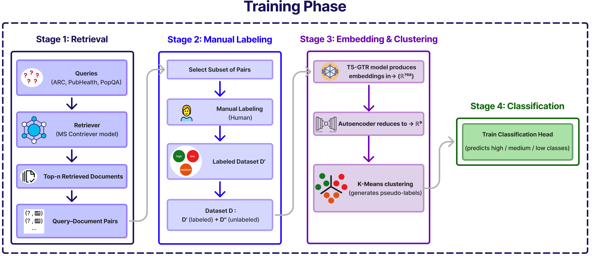
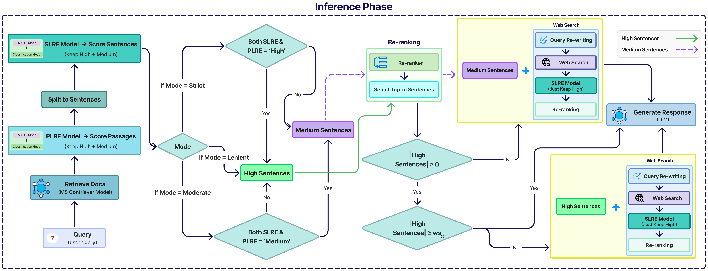

# MG-CRAG: Fusion of Multi-Granular Retrieval Evaluators in Corrective RAG with Weakly Supervised Fine-Tuning

This is the python implementation for MG-CRAG paper. This paper introduces multi-granular corrective retrieval-augmented generation (MG-CRAG), a novel framework that enhances response quality in retrieval-based systems by processing text at multiple levels of granularity. Building on recent CRAG approaches that mitigate hallucinations in large language models through irrelevant content filtering, our method addresses the limitations of heuristic labeling via a weakly supervised, four-stage pipeline that combines manual annotation with autoencoder-guided pseudo-labeling. The framework employs a sequential passage-level retrieval evaluator and sentence-level retrieval evaluator, both based on efficient T5 architectures, to hierarchically refine documents. The short-answer datasets used in this study include ARC-Challenge, PubHealth, and PopQA. MG-CRAG achieves state-of-the-art performance on ARC-Challenge (68.85% accuracy) and PopQA (59.89% accuracy), while delivering equal results on the PubHealth dataset despite a lower web search rate. Key advantages include significantly reduced dependence on web search, minimal labeled data requirements, and customizable inference modes (strict/moderate/lenient) that optimize performance across different dataset characteristics. The framework also enables tunable trade-offs between accuracy and web search usage, demonstrating that multi-granular processing enhances focus on relevant content, substantially improving answer accuracy while maintaining computational efficiency. 

Here is the training phase diagram:


and the inference phase diagram:



## Run Locally

For each stage in the original paper, there is a runnable notebook file in the notebooks folder. Each of them can be executed via Jupyter Notebook as well as Google Colab:

- [Step 0: Convert Texts to Embeddings Using T5-GTR](https://github.com/omidacoder/mg-crag/blob/main/notebooks/Step%200%20Convert%20Texts%20to%20Embeddings.ipynb)
 - [Step 1: Perform Clustering](https://github.com/omidacoder/mg-crag/blob/main/notebooks/Step%201%20Clustering.ipynb)
 - [Step 2: Train the ResidualNet as the Classification Head](https://github.com/omidacoder/mg-crag/blob/main/notebooks/Step%202%20Train%20Classification%20Head.ipynb)
 - [Step 3: Run Tests Using VLLM](https://github.com/omidacoder/mg-crag/blob/main/notebooks/Step%203%20Run%20Tests.ipynb)

## Required Hardware

All tests were conducted on an L4 GPU on Google Colab with 22 GB of memory. For running the retrieval section using the Contriever model, 100 GB of RAM is required. However, for executing the tests, high RAM is not necessary, and they can be run with as little as 12 GB of RAM.

## Downloads

All files generated by us for use in different parts of the project are available for download in this section:
- [Human Labeled Data](https://drive.google.com/drive/folders/1l5hQdUWQcR2-oWu3zFOTr64U83qZocPi?usp=sharing)
- [Selected Unlabeled Data](https://drive.google.com/drive/folders/1m5rQ4NmUlmv3nkKSJbuY5y0fR7qPNbtZ?usp=sharing)
- [Generated Embeddings](https://drive.google.com/drive/folders/10jQxf0lJ4jxoG7h92m2m_Mxz3oJIVPSa?usp=sharing)
- [Model Generations From Best Results](https://drive.google.com/drive/folders/1kNEFgow_JtfzBgflWKpnhAFBfon8VLKf?usp=sharing)
- [Train Retrievals](https://drive.google.com/drive/folders/19a3DlYQiuqvNjewgihgMwKPMU8b01oHe?usp=sharing)
- [Web Search Results](https://drive.google.com/drive/folders/1cJgFPr8dXOEKAkCpuXf5ed_qHG4XV7HR?usp=sharing)
  


These files are required in different parts of the notebooks. You can download our generated files or you can generate your pickle files using the notebooks.

Human labeled data has been labeled by our team, and you need to download it to get started. You can also use your own labeled data, provided it is in the same format as our labeled data, as human labeled data.

Files are in pickle format and can be opened in python using the following code:
```python
import pickle
file_path = "/path/to/anything.pickle"
with open(file_path, 'rb') as handle:
   loaded_file = pickle.load(handle)
# print or display the loaded file
print(loaded_file)
```

## Citation

If you find our code or the paper useful, please cite the paper:
```
@article{Masoumi2026,
  author  = {Masoumi, Negin and Davar, Omid and Eftekhari, Mahdi},
  title   = {MG-CRAG: fusion of multi-granular retrieval evaluators in corrective RAG with weakly supervised fine-tuning},
  journal = {Knowledge and Information Systems},
  year    = {2026},
  volume  = {68},
  number  = {1},
  pages   = {149},
  month   = {may},
  issn    = {0219-3116},
  doi     = {10.1007/s10115-026-02778-2},
  url     = {https://doi.org/10.1007/s10115-026-02778-2}
}
```


## Refferences

Some parts of the code in the project have been directly taken from the following repositories:

 - [Retrievals Using Contriever: Self-RAG](https://github.com/AkariAsai/self-rag)
 - [Prompts and Other CRAG Related Settings: CRAG](https://github.com/HuskyInSalt/CRAG)
 - [Project Structure and LangGraph implementation: CRAG LangGraph Implementation by Grecil](https://github.com/Grecil/Corrective-RAG)

we are thankful to them for sharing their codes.


